# 갤러리
## Site개발자
김기인
## 협력자
황동석
# [컨셉]

## 1. 메인 컨셉 : 탈출
- 게임 진행 중 유저는 특정 방에서 다음방으로 넘어 가는 데 필요한 단서를 찾을 수 있다. 단서의 종류로 열쇠와 힌트가 있다. 열쇠의 경우 초반부에는 눈에 잘 띄는 곳에 배치되어 있으나, 나중에는 유저가 방을 수색하여 열쇠를 찾아야 한다. 힌트의 경우 초반에는 간단한 내용이지만 나중에는 유저가 직접 추리를 해야하는 경우가 많아진다. 
### 1. 서브컨셉 : 손전등
- 안개가 자욱하게 깔린 어둠 속에서 유저가 손전등을 의존하게 한다. 
- 손전등에 배터리가 존재하며 10퍼씩 닳을 때 마다 밝기가 어두워지며 배터리가 모두 닳게 된다면 게임 오버가 된다. 
- 추가적인 배터리를 제공하여 방을 주기적으로 탐색하게 강제하게 된다.

### 2. 서브컨셉 : 사운드
- 오브젝트를 획득 할 때마다 각각의 사운드를 재생하며 손전등의 배터리가 적을 경우 긴박한 사운드를 재생한다.
- 긴박한 사운드를 통해서 유저는 게임오버 될 수 있다는 긴박함을 조성한다.

### 3. 서브컨셉 : 배경
- 안개 이펙트 오브젝트와 어두운 빛을 적절히 조화하여 몽환적인 미술관.

### 4. 서브컨셉 : 공포 유발 장식
- 조각상, 그림, 화분등 미술관에서 흔히 볼수있는 오브젝트와, 공포를 유발할 수 있는 기괴한 혹은 뒤틀린 조각상, 그림을 배치.

### 5. 서브컨셉: 멘탈 
- 기괴한 것과 마주치는 사람의 한계.

# [관련 이미지]
## 1. 이미지
-제한된 시야

-배경

-단서

-장식 (그림)

## 2. 동영상
https://youtube.com/shorts/Yj-VmCbSAd4?si=QwkafeEyrmZQi50U

https://youtu.be/UqWtavRip-8?si=rYiAuqSF71drcRrj

https://youtu.be/zUS83tGi0L0?si=KuAIZN7anZgWN7FP

# [구성 요소]
## 1. 매커니즘

### 1. 도전과제
1. 각 방에 있는 쪽지를 통해 퍼즐을 해결한다.
2. 손전등의 배터리가 모두 닳지않게 유지해야한다.
3. 정신력을 유지 하면서 탈출한다.

### 2. 재미요소

1)게임 진행 중 특정한 방에 곰돌이(이스터에그)룰 획득하면 게임의 스토리를 확인할 수 있게한다

2)각 방의 쪽지 내용을 다르게 설정하여 지루함을 방지한다.

3)손전등의 배터리 잔량에 따라 밝기가 어두워지는 것을 통해 긴박감 형성

4)기괴한 조각상 근처에  오래 있으면 정신력이 깎이기 때문에 오래있지 않도록 한다. 

## 2. 이야기

[만들게 된 배경]

평소에 퍼즐 요소를 풀거나 푸는 내용을 보는 것을 좋아하는데 그 과정에서 직접 퍼즐 요소들을 탐구해보고 그 탐구한 내용을 바탕으로 게임에 한번 적용 해보고 싶어서 시작하게 되었다.

[카메라 관점] 

플레이어의 시점을 기준으로 하기 위해 1인칭시점을 제공한다. 손전등 배터리에 따라서 손전등의 밝기를 조절하고 정신력에 따라서 화면의 시야의 선명도가 조절된다.

## 3. 미적요소

[디자인][컬러]

처음에는 정상적인 예술품이나 환경이 나타나지만 방을 지나갈 수록 점점 기괴한 환경이나 예술품이 나오는 식으로 하여 현재 상황을 나타내는 느낌으로 표현한다. 그리고 맵 후반을 갈수록 어두운 근원에 다가가는 현재상황을 기괴한 예술품들을 통해 표현한다.

[음향]

기괴한 예술품과 알맞는 음산한 분위기의 사운드를 사용.

불쾌한 웃음소리나 긴박함을 표현하는 사운드 사용

## 4. 기술

- Unity Engine : 유니티엔진을 사용하여 제작
- URP(universal render pipeline) : 빛계산을 효율적으로 관리해주는 유니티 렌더링 기술을 이용
- Blender : 무료 3D 모델링 프로그램을 사용하여 원하는 에셋 및 건물 사용
- Adobe Substance 3D Painter : 메터리얼 프로그램을 사용하여 퀄리티 향상

# 1. 게임 오브젝트 분해 (구성 요소 분석)

|연번|오브젝트 이름|오브젝트 이미지|
|:----:|:----:|:----:|
|1|플레이어|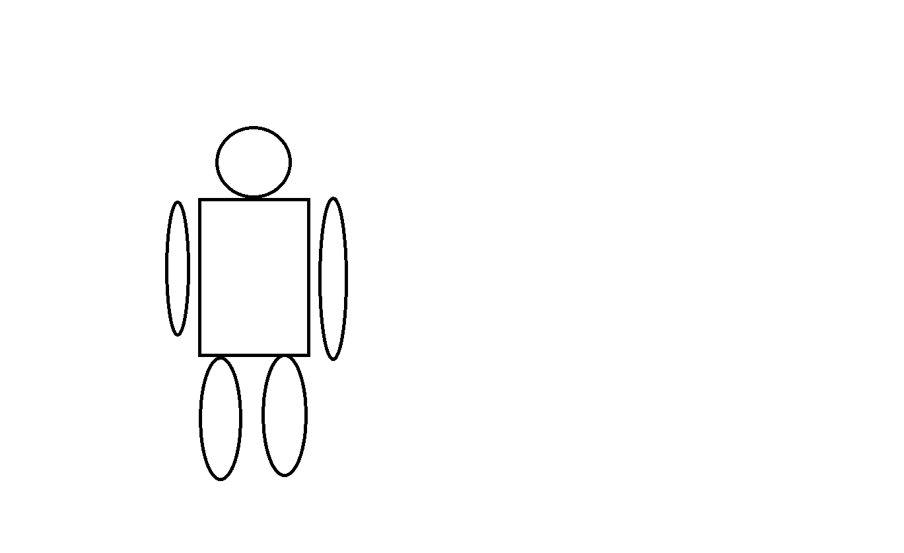|
|2|손전등|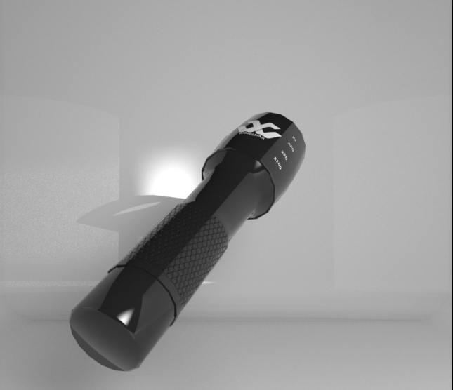|
|3|문|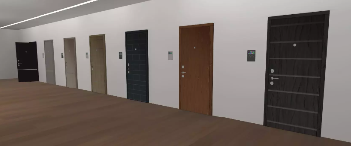|
|4|평범한 조각상|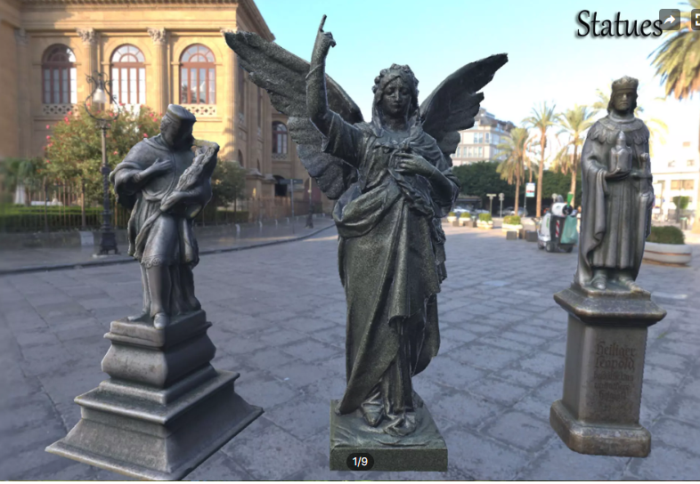|
|5|기괴한 조각상|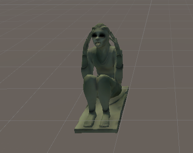|
|6|천사상|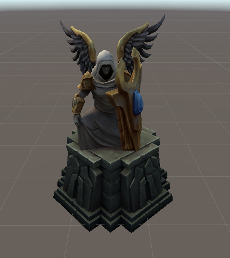|
|7|그림||
|8|기괴한 그림||
|9|단서||
|10|열쇠|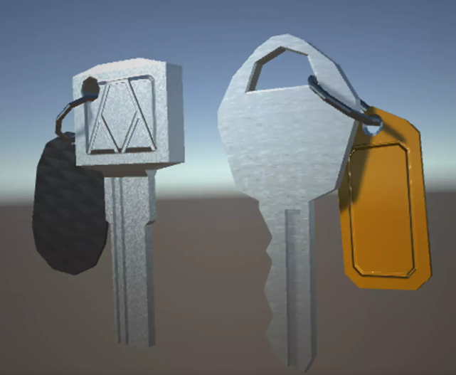|
|11|화분|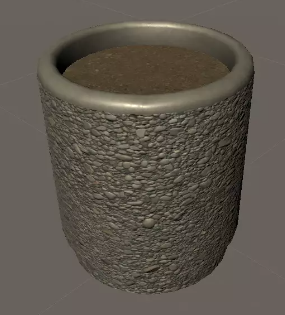|
|12|E키|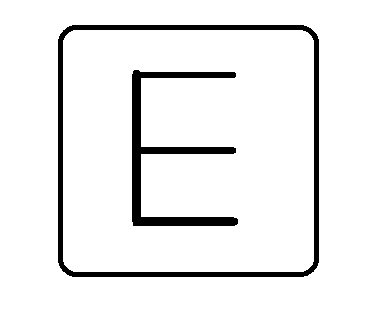|
|13|안개|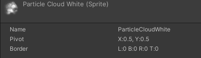|
|14|공포사운드|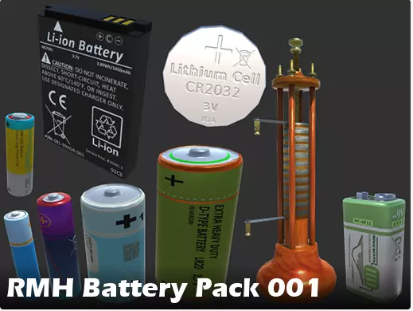|
|15|공포사운드1||
|16|기괴한 그림||
|17|광원||
|18|버튼||

# 2. 게임 파라미터 상태 뽑아내기

## 1. Player

|속성|오브젝트 이름|설명|비고|
|:---:|:---:|:---:|:---:|
|정신력|mental|플레이어의 정신려을 나타내는 수치타 게임의 체력과 유사함||
|스피드|speed|정신력에 따라 달라지는 플레이어 이동속도||
|상호작용|press Button|다른 오브젝트들과 상호작용 함.||
|획득|Get_Item|특정 아이템을 획득 하게함||

## 2. FlashLight

|속성|오브젝트 이름|설명|비고|
|:---:|:---:|:---:|:---:|
|빛의 세기|light_Intensity |배터리 적을수록 빛의 세기가 약해짐||
|배터리 잔량|light_bettery|배터리 잔량을 나타내는 수치||

## 3. 기괴한 조각상

|속성|오브젝트 이름|설명|비고|
|:---:|:---:|:---:|:---:|
|범위|M_DeBuff|플레이어의 정신력을 감소시킬 수 있는 범위 ||

## 4. 카메라

|속성|오브젝트 이름|설명|비고|
|:---:|:---:|:---:|:---:|
|레이케스트|rayCast_Range|기괴한 조각상이 레이케스트로 닿을 경우 정신력이 감소||

## 5. 문

|속성|오브젝트 이름|설명|비고|
|:---:|:---:|:---:|:---:|
|애니메이션|Open&Close|플레이어 또는 이벤트로 상호작용 함||

## 6. 천사상

|속성|오브젝트 이름|설명|비고|
|:---:|:---:|:---:|:---:|
|회복|M_Buff|플레이어의 정신력을 회복시킬 수 있는 범위||

## 7. 단서

|속성|오브젝트 이름|설명|비고|
|:---:|:---:|:---:|:---:|
|설명|show|단서에 적힌 내용을 보여줌||

# 3. 행동 뽑아내기

## 1.플레이어

|행동|설명|
|:---:|:---:|
|이동|W,S,A,D로 플레이어 이동 제어|
|상호작용 E|태그에 따라 오브젝트와 상호작용|

## 2.서랍

|행동|설명|
|:---:|:---:|
|상호작용 E|서랍이 열림|

# 4. 상태 뽑아내기
## 1.오브젝트 이름 : 플레이어

|현상태|전이상태|전이조건|
|:---:|:---:|:---:|
|Neutral|앞으로 이동|W키로 카메라 방향으로 이동|
|Neutral|뒤로 이동|S키로 카메라 반대 방향으로 이동|
|Neutral|왼쪽으로 이동|A키로 카메라의 왼쪽으로 이동|
|Neutral|오른쪽으로 이동|D키로 카메라의 오른쪽으로 이동|
|Neutral|카메라 흐려짐|정신력이 일정 이상 낮아진 경우|
|Neutral|정신력이 떨어짐|기괴한 조각상 범위 안에 있거나 바라볼 경우|
|Neutral|사망|정신력이 모두 없어질 경우|
|카메라 흐려짐|카메라가 선명해짐|정신력이 일정 이상 회복된 경우|
|정신력이 떨어진 상태|정신력이 회복됨|천사상 범위 안에 있을 경우|
|Neutral 및 행동중|상호작용이 일어남|E키를 눌렀을 때 tag가 item, proviso일 경우|
|Neutral 및 행동중|문을 염|E키를 눌렀을 때 tag가 door일 경우|

## 2.오브젝트 이름 : 손전등

|현상태|전이상태|전이조건|
|:---:|:---:|:---:|
|Neutral|빛을 잃음|배터리를 모두 소진했을 경우|
|빛이 밝음|서서히 빛이 어두워짐|배터리가 일정 이상 낮아질 경우|
|빛이 어두움|빛이 밝아짐|배터리를 획득한 경우|

## 3.오브젝트 이름 : 문

|현상태|전이상태|전이조건|
|:---:|:---:|:---:|
|문이 닫힘|문이 열림|퍼즐을 해결한 상황에서 플레이어와 상호작용 한 경우|

## 4.오브젝트 이름 : 작은 조각상

|현상태|전이상태|전이조건|
|:---:|:---:|:---:|
|엔딩에 다다른 경우|진 엔딩|작은 조각상 일정 개수 모은 경우|
|엔딩에 다다른 경우|노멀 엔딩|작은 조각상 일정 개수 모으지 못한 경우|

# 5.플레이어 캐릭터 속성(파라미터)

|속성|영문 명칭|설명|비고|
|:---:|:---:|:---:|:---:|
|상호작용 키|KeyCode.E|문을 열고 닫을 수 있고, 단서를 획득 할 수 있는 키||
|마우스 민감도|0~100|마우스의 민감도를 설정함||
|위치정보|Transform|캐릭터의 이동을 제어하는 정보||
|정신력|Mental|기괴한 조각상에게서 보호하기 위한 정신력||

# 6.게임의 규칙

핵심 규칙
- 유저는 1인칭 시점 싱글 플레이를 지원함.
- 플레이어는 방마다 존재하는 서로 다른 퍼즐을 풀면서 앞으로 나아가야함.
- 플레이어의 정신력이 0이 이나 손전등의 배터리가 0이 되면 게임오버 상태가 됨.
- 게임 자체의 시간 제한은 없지만 손전등의 배터리를 이용하여 시간 제약을 간접적으로 줌.
- 기괴한 조각상의 범위 안에 플레이어가 있거나 플레이어가 기괴한 조각상을 바라볼 경우 정신력이 감소함.
- 배터리를 획득할 경우 손전등의 배터리가 100%로 충전됨.

보조 규칙
- 작은 조각상을 모으면 진엔딩으로 가는 길이 열린다.
- 천사상 범위안에 플레이어가 있을 경우 정신력이 회복됨.
