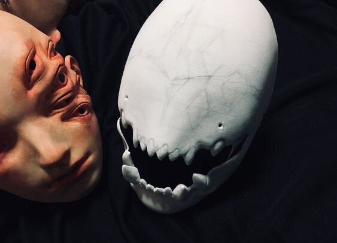
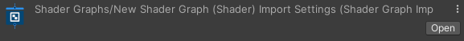

# 갤러리
## Site개발자
김기인
## 협력자
황동석
# [컨셉]

## 1. 메인 컨셉 : 탈출
-게임 진행 중 유저는 특정 방에서 다음방으로 넘어 가는 데 필요한 단서를 찾을 수 있습니다. 단서의 종류로 열쇠와 힌트가 있습니다. 열쇠의 경우 초반부에는 눈에 잘 띄는 곳에 배치되어 있으나, 나중에는 유저가 방을 수색하여 열쇠를 찾아야 합니다. 힌트의 경우 초반에는 간단한 내용이지만 나중에는 유저가 직접 추리를 해야하는 경우가 많아집니다. 
### 1. 서브컨셉 : 손전등
-안개가 자욱하게 깔린 어둠 속에서 유저가 손전등을 의존하게 합니다. 

-손전등에 배터리가 존재하며 10퍼씩 닳을 때 마다 밝기가 어두워지며 배터리가 모두 닳게 된다면 게임 오버가 됩니다. 

-추가적인 배터리를 제공하여 방을 주기적으로 탐색하게 강제하게 됩니다..

### 2. 서브컨셉 : 사운드
-오브젝트를 획득 할 때마다 각각의 사운드를 재생하며 손전등의 배터리가 적을 경우 긴박한 사운드를 재생합니다.

-긴박한 사운드를 통해서 유저는 게임오버 될 수 있다는 긴박함을 조성합니다.

### 3. 서브컨셉 : 배경
-안개 이펙트 오브젝트와 어두운 빛을 적절히 조화하여 몽환적인 배경을 연출.

### 4. 서브컨셉 : 공포 유발 장식
-조각상, 그림, 화분등 미술관에서 흔히 볼수있는 오브젝트와, 공포를 유발할 수 있는 기괴한 혹은 뒤틀린 조각상, 그림을 배치.

### 5. 서브컨셉: 침대 
-시작 시점을 침대를 배치하여 자신의 현재 상황이 꿈이라는 것을 유추할 수 있게 합니다
-세이브 지점을 침대로하여 안전하다는 느낌을 주게 합니다.

# [관련 이미지]
## 1. 이미지
-제한된 시야

-배경

-단서

-장식 (그림)

## 2. 동영상
https://youtube.com/shorts/Yj-VmCbSAd4?si=QwkafeEyrmZQi50U

https://youtu.be/UqWtavRip-8?si=rYiAuqSF71drcRrj

https://youtu.be/zUS83tGi0L0?si=KuAIZN7anZgWN7FP

# [구성 요소]
## 1. 매커니즘
### 1. 도전과제
1. 각 방에 있는 쪽지를 통해 퍼즐을 해결한다.
2. 손전등의 배터리가 모두 닳지않게 유지해야한다.
3. 정신력을 유지 하면서 탈출한다.
### 2. 재미요소
1)게임 진행 중 특정한 방에 곰돌이(이스터에그)룰 획득하면 게임의 스토리를 확인할 수 있게한다

2)각 방의 쪽지 내용을 다르게 설정하여 지루함을 방지한다.

3)손전등의 배터리 잔량에 따라 밝기가 어두워지는 것을 통해 긴박감 형성

4)기괴한 조각상 근처에  오래 있으면 정신력이 깎이기 때문에 오래있지 않도록 한다. 
## 2. 이야기
[만들게 된 배경]

평소에 퍼즐 요소를 풀거나 푸는 내용을 보는 것을 좋아하는데 그 과정에서 직접 퍼즐 요소들을 탐구해보고 그 탐구한 내용을 바탕으로 게임에 한번 적용 해보고 싶어서 시작하게 되었다.

[카메라 관점] 

플레이어의 시점을 기준으로 하기 위해 1인칭시점을 제공한다. 손전등 배터리에 따라서 손전등의 밝기를 조절하고 정신력에 따라서 화면의 시야의 선명도가 조절된다
## 3. 미적요소

[디자인][컬러]

처음에는 정상적인 예술품이나 환경이 나타나지만 방을 지나갈 수록 점점 기괴한 환경이나 예술품이 나오는 식으로 하여 현재 상황을 나타내는 느낌으로 표현한다. 그리고 맵 후반을 갈수록 어두운 근원에 다가가는 현재상황을 기괴한 예술품들을 통해 표현한다.

[음향]

기괴한 예술품과 알맞는 음산한 분위기의 사운드를 사용.

불쾌한 웃음소리나 긴박함을 표현하는 사운드 사용
## 4. 기술
- Unity Engine : 유니티엔진을 사용하여 제작
- URP(universal render pipeline) : 빛계산을 효율적으로 관리해주는 유니티 렌더링 기술을 이용
- Blender : 무료 3D 모델링 프로그램을 사용하여 원하는 에셋 및 건물 사용
- Adobe Substance 3D Painter : 메터리얼 프로그램을 사용하여 퀄리티 향상

# 1. 게임 오브젝트 분해 (구성 요소 분석)

|연번|오브젝트 이름|오브젝트 이미지|
|:----:|:----:|:----:|
|1|플레이어||
|2|손전등||
|3|문||
|4|평범한 조각상||
|5|기괴한 조각상||
|6|천사상||
|7|그림||
|8|기괴한 그림||
|9|단서||
|10|열쇠||
|11|화분||
|12|E키||
|13|안개||
|14|공포사운드||
|15|공포사운드1||
|16|기괴한 그림||
|17|광원||
|18|버튼||

